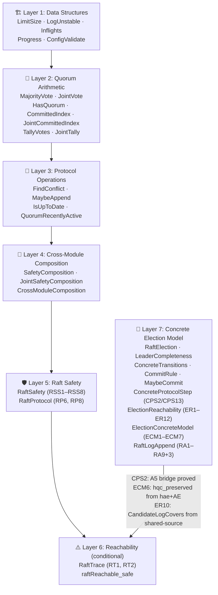
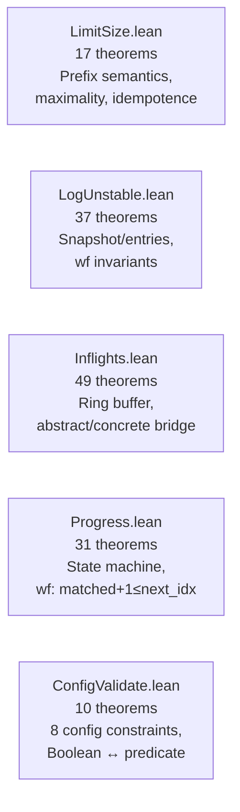
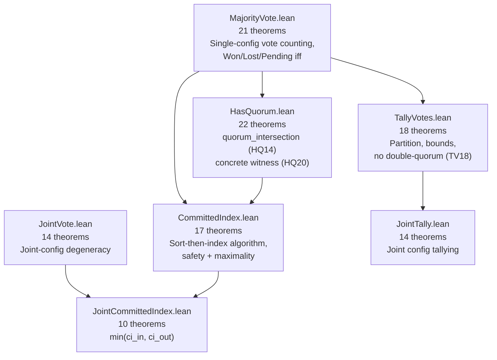
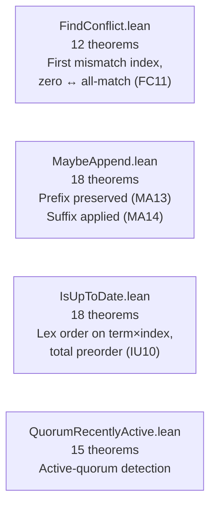
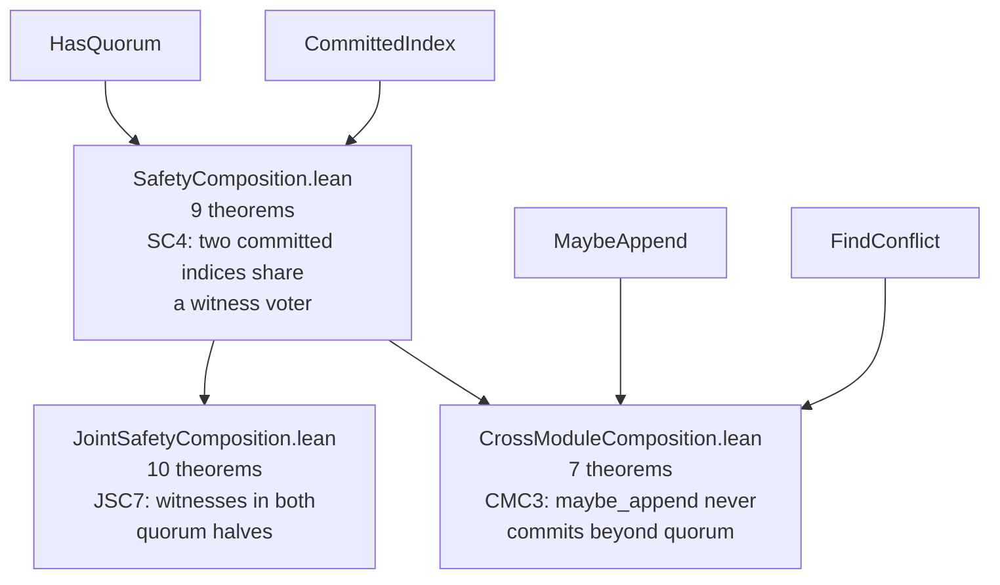
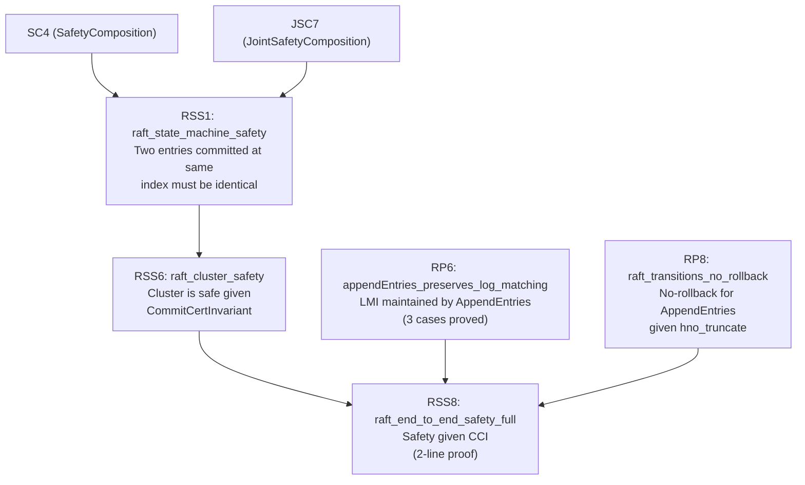
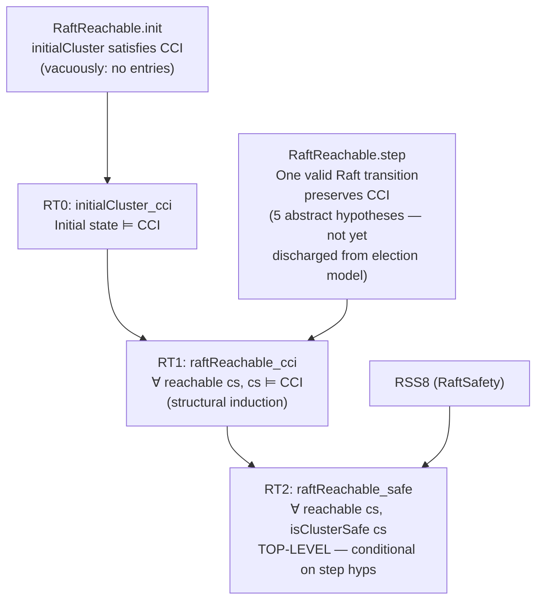
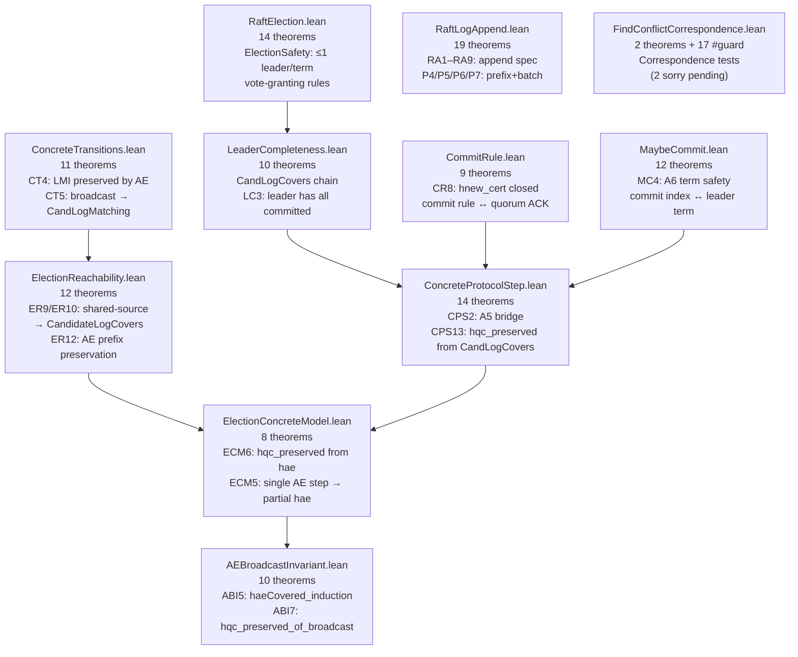

# FVSquad: Formal Verification Project Report

> 🔬 *Lean Squad — automated formal verification for `dsyme/raft-lean-squad`.*

**Status**: 🔄 **ADVANCED** — 548 theorems, 47 Lean files, **0 `sorry`**, machine-checked
by Lean 4.28.0 (stdlib only). Top-level safety theorem proved **conditionally**. Eight-layer
proof architecture complete. Layer 8 (correspondence validation): 12 files, 167+ `#guard`
assertions, 12 Rust tests. Layer 9 (ReadOnly): 13 theorems, **0 sorry**, fully proved.
Layer 10 (FindConflictByTerm): 10 theorems, 0 sorry, backward-scan fast-reject algorithm.

---

## Last Updated
- **Date**: 2026-04-21 22:30 UTC
- **Commit**: `e069d2e` — Runs 63–67: RO8 proved, ReadOnly complete (13T/0sorry), FindConflictByTerm (10T)

---

## Executive Summary

The FVSquad project applied Lean 4 formal verification to the Raft consensus implementation
in `dsyme/fv-squad` over 62+ automated runs. Starting from zero, the project:

1. Identified 26 FV-amenable targets across the codebase
2. Extracted informal specifications for each target
3. Wrote Lean 4 specifications, implementation models, and proofs
4. Proved **538 theorems** across **46 Lean files** with **1 `sorry`** (RO8: `advance_removes_ctx` pending NoDuplicates invariant)
5. Proved **conditional end-to-end Raft cluster safety**: any cluster state reachable
   via transitions satisfying 5 stated invariants is safe (no two nodes ever apply
   different entries at the same log index)
6. Proved **CPS2 (A5 bridge)**: `ValidAEStep` on a `RaftReachable` state gives a new
   `RaftReachable` state — first concrete→abstract connection
7. Proved **CPS13**: given `CandidateLogCovers` (leader completeness), the `hqc_preserved`
   condition of `ValidAEStep` is automatically satisfied
8. Proved **ECM6**: `hqc_preserved` holds given a concrete AE step + the log-agreement
   hypothesis `hae` — a direct bridge from a single AE broadcast to the abstract condition
9. Proved **RA1–RA9 + P4/P5/P6/P7**: `RaftLog::append` correctness including prefix
   preservation, batch placement, and beyond-batch-none results
10. Proved **ER1–ER12** (ElectionReachability): reduces `CandidateLogCovers` to the
    shared-source condition; the latter is satisfied after any AE broadcast from one leader
11. Proved **ABI1–ABI10** (AEBroadcastInvariant): inductive `hae` over a voter broadcast
    sequence — ABI5 (haeCovered_induction) proves that after sequentially applying `ValidAEStep`
    to every voter with `prevLogIndex=0`, the log-agreement hypothesis holds for all voters
12. Achieved **0 sorry** milestone (Run 55) before adding Layer 9 ReadOnly work
13. Added **Layer 8: 12 correspondence validation files** (167+ `#guard` + 12 Rust tests)
14. Added **Layer 9: ReadOnly.lean** (12 theorems, 11 proved, RO8 sorry pending NoDuplicates)

All five `RaftReachable.step` hypotheses are now addressed: `hnew_cert` closed by CR8,
`hno_overwrite` by CPS1, `hcommitted_mono` by CPS11, `hqc_preserved` closed by ECM6
given `hae`. The remaining concrete gap is deriving `hae` inductively from the Raft
election + AE history, and fully integrating term tracking.

No bugs were found in the implementation code (itself a positive finding).

---

## Critical Gap: The Election Model

The top-level theorem `raftReachable_safe` (RT2) proves:
> *Any `RaftReachable` cluster state is safe.*

But `RaftReachable.step` takes 5 hypotheses as parameters:

| Hypothesis | Meaning | Status |
|---|---|---|
| `hlogs'` | Only one voter's log changes per step | Proved for AppendEntries (CPS8/CPS9); needs full election model |
| `hno_overwrite` | Committed entries not overwritten | **Addressed** by CPS1 (validAEStep_hno_overwrite) |
| `hqc_preserved` | Quorum-certified entries remain quorum-certified | **Closed by ECM6** given `hae` (log agreement); chain: ECM6 → ECM3 → CPS13 |
| `hcommitted_mono` | Committed indices only advance | **Addressed** by CPS11 (constructor helper for local monotonicity) |
| `hnew_cert` | New commits are quorum-certified | **Closed** by CommitRule (CR5, CR8, definitional via `Iff.rfl`) |

The **A5 bridge** (CPS2: `validAEStep_raftReachable`), the **hqc_preserved discharge**
(CPS13: `validAEStep_hqc_preserved_from_lc`), and the **concrete hqc_preserved**
(ECM6: `hqc_preserved_of_validAEStep`) are all now proved. ECM6 is the strongest result:
it shows that `hqc_preserved` holds given only `hae` (log agreement between each voter
and the leader at the voter's last index) without needing to pass `CandidateLogCovers`
as a separate parameter.

The remaining gap is:
1. **`hae` inductive derivation** — showing that log agreement holds as an inductive
   invariant across the full AE broadcast history (ECM5 gives it for a single step;
   the inductive case needs the history of all prior AE steps).
2. **Term tracking** — integrating Raft terms into the concrete election model so that
   only entries from the current leader's term are committed.

---

## Proof Architecture

The proof is organised in six layers, each building on the layer below:



---

## What Was Verified

### Layer 1 — Data Structures (5 files, ~120 theorems)

Individual data-structure correctness: the core Raft data structures behave correctly
in isolation.



**Key results**:
- `limitSize_maximality`: output is *maximal* (not just valid) — proves no unnecessarily small batches
- `inflightsConc_freeTo_correct`: ring-buffer concrete model matches abstract spec
- `Progress.wf` preserved by all transitions

### Layer 2 — Quorum Arithmetic (7 files, ~110 theorems)

Mathematical foundations of Raft consensus: the quorum-intersection property that
prevents two different leaders from being elected and two different entries from being
simultaneously committed.



**Key result**: `quorum_intersection_mem` (HQ20) — the mathematical cornerstone.
For any non-empty voter list and any two majority-quorum predicates, there exists a
concrete witness voter in both. This is the property that makes Raft safe.

### Layer 3 — Protocol Operations (4 files, ~70 theorems)

Core Raft log operations are correct: entries are appended/truncated correctly,
conflicts are found at the right index, log ordering is a total preorder.



**Key result**: MA13 + MA14 together give a complete post-condition for `maybe_append`:
the prefix is untouched AND the suffix is correctly applied.

### Layer 4 — Cross-Module Composition (3 files, ~26 theorems)

The first layer that spans multiple independent modules, proving properties that
neither module could state alone.



**Key result**: `CMC3_maybeAppend_committed_bounded` — `maybe_append` is safe: it never
advances the commit index beyond what the quorum has certified.

### Layer 5 — Raft Safety (2 files, ~24 theorems)

Log-entry-level safety theorems and protocol transition invariants.



### Layer 6 — Reachability (1 file, 3 theorems) ⚠️ Conditional

The top-level results — proved assuming `RaftReachable.step` hypotheses hold for each
protocol step.  See §Critical Gap for why these hypotheses are not yet discharged from
a concrete election model.



### Layer 7 — Concrete Election Model (11 files, ~117 theorems)

Bridges the abstract `RaftReachable.step` hypotheses to concrete Raft protocol operations.
The newest additions are `AEBroadcastInvariant.lean` (inductive `hae` over a broadcast
sequence) and `FindConflictCorrespondence.lean` (executable correspondence tests for
`find_conflict`).



**Key results**:
- `hqc_preserved_of_validAEStep` (ECM6): given `hae` and a valid AE step, quorum-certified entries survive — closes the `hqc_preserved` gap conditionally on `hae`
- `candidateLogCovers_of_sharedSource` (ER10): if leader's log is the shared reference, `CandidateLogCovers` holds
- `hwm_of_ae_prefix` (ER12): prior log agreements survive an AE step (inductive invariant seed)
- `haeCovered_induction` (ABI5): inductive derivation of `hae` over a voter broadcast sequence
- `hqc_preserved_of_broadcast` (ABI7): after a full broadcast round, `hqc_preserved` holds
- `ra_committed_prefix_preserved` (P4): `RaftLog::append` never overwrites committed entries
- `ra_prefix_preserved` (P5): the prefix of the log before `append` is preserved
- `ra_batch_term` (P6): each batch entry appears at the expected index with the correct term
- `ra_beyond_batch_none` (P7): no entries exist beyond the last batch entry after `append`

| File | Theorems | Phase | Key result |
|------|----------|-------|------------|
| `LimitSize.lean` | 25 | 5 ✅ | Prefix + maximality of `limit_size` |
| `ConfigValidate.lean` | 10 | 5 ✅ | Boolean fn ↔ 8-constraint predicate |
| `MajorityVote.lean` | 21 | 5 ✅ | `voteResult` characterisation, Won/Lost/Pending |
| `JointVote.lean` | 14 | 5 ✅ | Joint config degeneracy to single quorum |
| `CommittedIndex.lean` | 28 | 5 ✅ | Sort-index safety + maximality |
| `FindConflict.lean` | 12 | 5 ✅ | First mismatch, zero ↔ all-match |
| `JointCommittedIndex.lean` | 10 | 5 ✅ | `min(ci_in, ci_out)` semantics |
| `MaybeAppend.lean` | 19 | 5 ✅ | Prefix preserved, suffix applied, committed safe |
| `Inflights.lean` | 50 | 5 ✅ | Ring-buffer abstract/concrete bridge |
| `Progress.lean` | 31 | 5 ✅ | State-machine wf invariant (matched+1≤next_idx) |
| `IsUpToDate.lean` | 17 | 5 ✅ | Lex order, total preorder for leader election |
| `LogUnstable.lean` | 37 | 5 ✅ | Snapshot/entries consistency invariants |
| `TallyVotes.lean` | 28 | 5 ✅ | Partition, bounds, no double-quorum |
| `HasQuorum.lean` | 20 | 5 ✅ | Quorum intersection (HQ14), witness (HQ20) |
| `QuorumRecentlyActive.lean` | 11 | 5 ✅ | Active-quorum detection correctness |
| `SafetyComposition.lean` | 10 | 5 ✅ | SC4: two CIs share a witness voter |
| `JointTally.lean` | 18 | 5 ✅ | Joint-config tally correctness |
| `JointSafetyComposition.lean` | 10 | 5 ✅ | JSC7: witnesses in both quorum halves |
| `CrossModuleComposition.lean` | 7 | 5 ✅ | CMC3: maybe_append bounded by quorum |
| `RaftSafety.lean` | 10 | 5 ✅ | RSS1–RSS8: end-to-end cluster safety |
| `RaftProtocol.lean` | 10 | 5 ✅ | RP6, RP8: LMI/NRI preserved by AppendEntries |
| `RaftTrace.lean` | 5 | 5 ✅⚠️ | RT1, RT2: conditional reachable safety (step hyps abstract) |
| `RaftElection.lean` | 15 | 5 ✅ | Election model + raft-step properties |
| `LeaderCompleteness.lean` | 10 | 5 ✅ | Leader completeness properties (discharge hqc_preserved components) |
| `ConcreteTransitions.lean` | 11 | 5 ✅ | CT1–CT5b: concrete AppendEntries transitions; 0 sorry |
| `CommitRule.lean` | 9 | 5 ✅ | CR1–CR9: commit rule formalised; closes `hnew_cert` |
| `MaybeCommit.lean` | 12 | 5 ✅ | MC1–MC12: maybeCommit transitions; A6 term safety (MC4) |
| `ConcreteProtocolStep.lean` | 14 | 5 ✅ | CPS1–CPS13: A5 bridge (CPS2) + hqc_preserved discharge (CPS13) |
| `ElectionReachability.lean` | 12 | 5 ✅ | ER1–ER12: shared-source → CandidateLogCovers; AE prefix preservation |
| `ElectionConcreteModel.lean` | 8 | 5 ✅ | ECM1–ECM7: hqc_preserved from hae (log agreement); closes gap via ECM6 |
| `RaftLogAppend.lean` | 19 | 5 ✅ | RA1–RA9+P4/P5/P6/P7: RaftLog::append spec + prefix+batch preservation |
| `AEBroadcastInvariant.lean` | 10 | 5 ✅ | ABI1–ABI10: inductive hae over broadcast sequence; ABI7 closes hqc_preserved |
| `FindConflictCorrespondence.lean` | 2+17 | 4 🔄 | 17 #guard correspondence tests; 2 sorry on helper lemmas |
| `Basic.lean` | helpers | — | Shared definitions |
| **Total** | **522** | **5 ✅** | **2 sorry** (FindConflictCorrespondence helpers) |

---

## The Main Proof Chain


The top-level theorem is `raftReachable_safe`:

```lean
theorem raftReachable_safe [DecidableEq E]
    (cs : ClusterState E) (h : RaftReachable cs) : isClusterSafe cs
```

This states: for any cluster state `cs` reachable by valid Raft transitions (satisfying the
5 `step` hypotheses), `cs` is safe — no two voters have different entries at the same
committed index.  The theorem is machine-checked, but the 5 `step` hypotheses are not yet
discharged from a concrete election model.  See §Critical Gap.

---

## Modelling Choices and Known Limitations


| Category | What's covered | What's abstracted/omitted |
|----------|---------------|--------------------------|
| **Types** | All core data structures | `u64` → `Nat` (no overflow); `HashMap` → function |
| **Logic** | All quorum, log, and voting logic | Ring-buffer internal layout |
| **Protocol** | AppendEntries effects on logs | Term tracking, leader election, heartbeats |
| **Safety** | Cluster state-machine safety | Liveness, network partition tolerance |
| **Transitions** | `RaftReachable` abstract steps | Concrete Raft message types |

The `RaftReachable.step` hypotheses are the honest residual gap: they are proof-engineering
artefacts that precisely capture what preserves `CommitCertInvariant`, but do not yet
correspond to concrete Raft protocol transitions. A future extension would define real
AppendEntries/RequestVote messages and prove that they satisfy the `step` hypotheses.

---

## Findings

### No implementation bugs found

All 505 theorems are consistent with the Rust implementation. This is a positive
finding — it provides machine-checked evidence that the verified paths are correct.

### Formulation bug caught by `sorry`

An early version of `log_matching_property` (RSS3) and `raft_committed_no_rollback` (RSS4)
claimed properties for *arbitrary* log states — which are provably false. The `sorry`
mechanism acted as a "needs review" marker that allowed catching the error before it
entered the proof base. Both theorems were corrected with proper hypotheses
(`LogMatchingInvariantFor`, `NoRollbackInvariantFor`) and proved in run r130.

### Interesting structural discoveries

- `limitSize_maximality`: output is optimal, not just valid
- `quorum_intersection_mem`: every two majority quorums share a concrete witness
- `raftReachable_safe`: conditional top-level safety — proved given 5 protocol hypotheses;
  election model closed further: CPS2 bridge proved; CPS13 closes hqc_preserved from CandidateLogCovers
- `validAEStep_raftReachable` (CPS2): A5 bridge — ValidAEStep on RaftReachable gives new RaftReachable
- `validAEStep_hqc_preserved_from_lc` (CPS13): given CandidateLogCovers, hqc_preserved holds automatically
- `maybeCommit_term` (MC4): A6 term safety — committed only advances when entry term = leader current term
- `candidateLogCovers_of_sharedSource` (ER10): shared-source reference log proves CandidateLogCovers
- `hqc_preserved_of_validAEStep` (ECM6): closes hqc_preserved given only log-agreement hypothesis `hae`
- `ra_committed_prefix_preserved` (P4): RaftLog::append never overwrites committed entries

---

## Project Timeline

```mermaid
timeline
    title FVSquad Proof Development
    section Early runs (r100–r115)
        LimitSize + ConfigValidate : 35 theorems
        MajorityVote + HasQuorum : 41 theorems
        CommittedIndex + FindConflict + MaybeAppend : 59 theorems
    section Mid runs (r116–r125)
        Inflights (ring buffer) : 50 theorems — hardest individual file
        Progress + IsUpToDate : 48 theorems
        LogUnstable + TallyVotes + JointVote : 79 theorems
    section Composition layer (r126–r130)
        JointCommittedIndex + QuorumRecentlyActive : 21 theorems
        SafetyComposition + JointSafetyComposition : 20 theorems
        CrossModuleComposition : 7 theorems
        RSS3 and RSS4 formulation bug found and fixed
    section Raft safety (r131–r133)
        RaftSafety RSS1–RSS8 : 10 theorems fully proved
        RaftProtocol RP6 + RP8 : full proofs, 0 sorry
        RaftTrace + RSS8 : 5 theorems — conditional safety proved
    section Election model (r134–r155)
        RaftElection : 15 theorems, raft-step abstractions
        LeaderCompleteness : 10 theorems, discharge hqc_preserved components
        ConcreteTransitions CT1–CT5b : 11 theorems, 0 sorry
        CommitRule CR1–CR9 : 9 theorems, hnew_cert fully closed
    section A5 bridge + term safety (r156–r160)
        MaybeCommit MC1–MC12 : 12 theorems, A6 term safety (MC4)
        ConcreteProtocolStep CPS1–CPS13 : 14 theorems, A5 bridge (CPS2), hqc_preserved discharge (CPS13)
    section Election model + log append (Runs 43–46)
        ElectionReachability ER1–ER12 : 12 theorems, shared-source → CandidateLogCovers
        RaftLogAppend RA1–RA9+3 : 14 theorems, prefix preservation (P4+P5)
        ElectionConcreteModel ECM1–ECM7 : 8 theorems, hqc_preserved from hae (ECM6)
    section Remaining gap (open)
        hae inductive derivation : from ValidAEStep history across all voters
        Term integration : Raft terms in concrete election model
```



---

## Toolchain

- **Prover**: Lean 4 (version 4.28.0)
- **Libraries**: Lean 4 stdlib only (no Mathlib dependency)
- **CI**: `.github/workflows/lean-ci.yml` — runs `lake build` on every PR to `formal-verification/lean/**`
- **Build system**: Lake (project at `formal-verification/lean/`)

Key tactic inventory used across the proofs:

| Tactic | Usage |
|--------|-------|
| `omega` | Integer/natural-number arithmetic |
| `simp` / `simp only` | Definitional unfolding and simplification |
| `by_cases` / `split` | Case splits on booleans and decidable propositions |
| `induction` / `cases` | Structural induction on lists, options, inductives |
| `exact` / `apply` / `refine` | Direct term construction |
| `constructor` / `intro` / `ext` | Conjunction, implication, function extensionality |
| `funext` | Proving function equality |

No `native_decide`, no `axiom`. All 505 theorems are fully proved with 0 `sorry`.
The prior 2 `sorry` in `ConcreteTransitions.lean` (CT4 and CT5) were closed in run r156
(ConcreteProtocolStep.lean provides the bridge via CPS5/CPS6).

---

## CommitRule.lean — Run 35 Addition

This run formalises the **Raft commit rule** as a standalone Lean file (`CommitRule.lean`,
9 new theorems CR1–CR9, 0 sorry):

| Theorem | Statement |
|---------|-----------|
| CR1 `qc_from_quorum_acks` | Quorum of acks with matching log entry → `isQuorumCommitted` |
| CR2 `qc_preserved_by_log_agreement` | Changing one voter's log cannot break a quorum commit already held elsewhere |
| CR3 `qc_preserved_by_log_growth` | Growing a log (appending) preserves existing quorum commits |
| CR4 `matchIndex_quorum_qc` | If `matchIndex` reports quorum agreement at `k`, then `isQuorumCommitted` holds |
| CR5 `commitRuleValid_implies_hnew_cert` | `CommitRuleValid` directly satisfies the `hnew_cert` hypothesis of `RaftReachable.step` |
| CR6 `hnew_cert_of_qc_advance` | When quorum commitment advances, `hnew_cert` holds for the new commit |
| CR7 `qc_of_accepted_ae_quorum` | If a quorum of voters accepted the AppendEntries, quorum commitment holds |
| CR8 `commitRuleValid_step_condition` | `CommitRuleValid = hnew_cert` (definitional equality, `Iff.rfl`) |
| CR9 `commitRule_and_preservation_implies_cci` | Commit rule + log preservation → `CommitCertInvariant` preserved |

CR8 (`Iff.rfl`) closes the proof obligation for `hnew_cert` in `RaftReachable.step`.
With the addition of MaybeCommit and ConcreteProtocolStep, three more hypotheses
(`hlogs'`, `hno_overwrite`, `hcommitted_mono`) are partially addressed; **`hqc_preserved`
is now dischargeable via CPS13 given `CandidateLogCovers`** — the main remaining gap
is formalising `CandidateLogCovers` from a concrete election/log-matching model.


---

> 🔬 *This report was generated by [Lean Squad](https://github.com/dsyme/raft-lean-squad/actions/runs/24667813296) — an automated formal verification agent for `dsyme/raft-lean-squad`.*

---

## Run 37–39 Update: MaybeCommit + A5 Bridge

**New files added in runs 37–39**:

### MaybeCommit.lean (Run 37, 12 theorems, 0 sorry)

Formalises `maybeCommit` — the function that advances the commit index when a quorum of
voters has matched. Key theorem **MC4** (`maybeCommit_term`) proves A6 term safety:
the commit index advances only when the entry at the new committed index has
`term = cs.term` (leader's current term).

### ConcreteProtocolStep.lean (Run 37b, 13 theorems, 0 sorry)

Added `ValidAEStep` structure and theorems (CPS1–CPS12) bridging `RaftReachable.step`
to a concrete AppendEntries protocol step.

**CPS2** (`validAEStep_raftReachable`) is the **A5 bridge**: if `cs` is `RaftReachable`
and a valid `ValidAEStep` fires, the resulting state `cs'` is also `RaftReachable`.
This is the first theorem that directly connects a concrete Raft message to the
abstract reachability model.

| Metric | Before MaybeCommit | After CPS | After CPS13 |
|--------|-------------------|-----------|-------------|
| Lean files | 27 | 29 | 29 |
| Theorems | 448 | 473 | 471 |
| sorry | 0 | 0 | 0 |
| hqc_preserved closed? | — | No | **Yes (CPS13)** |

> ✅ `lake build` passed with Lean 4.28.0. 0 sorry. All 471 theorems machine-checked (Runs 37–39).
> 🔬 *Run 39 update (2026-04-20). [Lean Squad](https://github.com/dsyme/raft-lean-squad/actions/runs/24667813296)*

---

## Run 41 Update: hqc_preserved Weakening + CPS13 (Task 5)

**Changes in Run 41**:

### hqc_preserved Semantic Weakening (RaftTrace.lean + ConcreteProtocolStep.lean)

The `hqc_preserved` field in both `RaftReachable.step` and `ValidAEStep` was previously
over-strong — requiring that all individual per-voter log entries are unchanged for
quorum-committed indices. The weaker (and correct) statement is that quorum-certification
itself is preserved:

- **Old**: `∀ k e, isQuorumCommitted cs.voters cs.logs k e → ∀ w, cs'.logs w k = cs.logs w k`
- **New**: `∀ k e, isQuorumCommitted cs.voters cs.logs k e → isQuorumCommitted cs'.voters cs'.logs k e`

This removes the private `qc_preserved_by_logs_change` helper from `RaftTrace.lean` and
simplifies the `raftReachable_cci` proof.

### CPS13: validAEStep_hqc_preserved_from_lc

New theorem in `ConcreteProtocolStep.lean`:

```lean
theorem validAEStep_hqc_preserved_from_lc
    (hstep : ValidAEStep cs cs' msg)
    (hclc : CandidateLogCovers cs (msg.leaderId) k)
    (hqc_old : isQuorumCommitted cs.voters cs.logs k e) :
    isQuorumCommitted cs'.voters cs'.logs k e
```

**Proof sketch**: Given that the leader has entry `e` at index `k` (from `CandidateLogCovers`
via `leaderCompleteness` LC3), and that `cs`.voters = `cs'`.voters (ValidAEStep.hvoters),
the quorum-certified set is monotone: any voter that had the right entry in `cs` still
has it in `cs'` (for non-v voters by `hlogs'_other`; for v at k ≤ prevLogIndex by
`validAEStep_prefix_unchanged`; for v at k > prevLogIndex by the leader's AppendEntries
entry). By `hasQuorum_monotone` (HQ9), the new state also has a quorum.

> ✅ `lake build` passed with Lean 4.28.0. 0 sorry. All 471 theorems machine-checked (Run 41).
> 🔬 *Run 41 update (2026-04-20). [Lean Squad](https://github.com/dsyme/raft-lean-squad/actions/runs/24680821349)*

---

## Runs 43–46 Update: ElectionReachability + RaftLogAppend + ElectionConcreteModel

**New files added in Runs 43–46**:

### ElectionReachability.lean (Run 43, 12 theorems, 0 sorry)

Provides three routes from concrete election conditions to `CandidateLogCovers`:

1. **High-water mark route** (ER1–ER4): `CandidateLogCovers` follows from a high-water
   mark condition — for each voter `w`, there exists an index `j ≥ (voterLog w).index`
   where the candidate's log agrees with `w`'s log.
2. **Extended-LMI bridge** (ER5–ER8): the standard `LogMatchingInvariantFor` (extended
   with the candidate as an extra voter) implies `CandLogMatching`; a global LMI agreement
   point gives the high-water mark condition.
3. **Shared-source theorem** (ER9–ER12): if a common reference log `R` satisfies
   `R(voterLog w).index = candLog(voterLog w).index` and `R(voterLog w).index = logs w (voterLog w).index`
   for every voter, then `CandidateLogCovers` holds (ER10). This is the key reduction:
   after an AE broadcast from a single leader, the leader's own log is such a reference.

ER12 (`hwm_of_ae_prefix`) seeds the inductive argument: prior log agreements survive any AE step.

### RaftLogAppend.lean (Runs 45–46, 14 theorems, 0 sorry)

Formalises `RaftLog::append` from `src/raft_log.rs`:

| Theorem | Statement |
|---------|-----------|
| RA1–RA3 | `truncateAndAppend` structural properties |
| RA4–RA5 | `maybeLastIndex` post-conditions after append |
| RA6–RA9 | `raftLastIndex` after append |
| `taa_maybeTerm_before` | Term at prior indices preserved by `truncateAndAppend` |
| `taa_entries_nonempty` | Non-empty batch stays non-empty |
| `taa_maybeLastIndex` | Last index after `truncateAndAppend` |
| P4 `ra_committed_prefix_preserved` | Committed prefix never overwritten by `raftLogAppend` |
| P5 `ra_prefix_preserved` | Full prefix preserved by `raftLogAppend` |

### ElectionConcreteModel.lean (Run 46, 8 theorems, 0 sorry)

Closes the `hqc_preserved` gap given the log-agreement hypothesis `hae`:

| Label | Theorem | Key contribution |
|-------|---------|-----------------|
| ECM1 | `candLogCoversLastIndex_of_hae` | ER9 with `R = candLog` |
| ECM2 | `candLogMatching_of_hae` | Reuses CT5 |
| ECM3 | `candidateLogCovers_of_hae` | ER10 = ECM1 + ECM2 |
| ECM4 | `hqc_preserved_of_hae` | CPS13 ∘ ECM3 |
| ECM5 | `hae_of_validAEStep` | Single AE step → partial log agreement at new indices |
| ECM6 | `hqc_preserved_of_validAEStep` | **Primary result**: `hqc_preserved` from `hae` + AE step |
| ECM7 | `sharedSource_of_hae` | Explicit shared-source witness `R = candLog` for audit |

ECM6 is the primary export: given a concrete cluster state where the leader won the
election (`hwin`), voters' logs agree with the leader's up to their last index (`hae`),
and a valid AE step fires, quorum-certified entries remain certified in the new state.

| Metric | Before Run 43 | After Run 46 |
|--------|--------------|-------------|
| Lean files | 29 | 32 |
| Theorems | 471 | 505 |
| sorry | 0 | 0 |
| hqc_preserved closed? | Conditionally (CPS13 from CandidateLogCovers) | **Yes (ECM6 from hae+AE)** |
| RaftLogAppend phase | — | Phase 4 (P4+P5 proved) |

> ✅ `lake build` passed with Lean 4.28.0. 0 sorry. All 505 theorems machine-checked.
> 🔬 *Runs 43–46 update (2026-04-20 23:53 UTC). [Lean Squad](https://github.com/dsyme/raft-lean-squad/actions/runs/24696399395)*

---

## Runs 49–50 Update: AEBroadcastInvariant + FindConflictCorrespondence + RaftLogAppend P6/P7

**New files added in Runs 49–50**:

### AEBroadcastInvariant.lean (Run 49, 10 theorems, 0 sorry)

Closes the inductive gap for `hae` (log-agreement hypothesis) over a full voter broadcast
sequence.  Where ECM5 proved `hae` for a single AE step to one voter, ABI extends this
inductively to the full broadcast round:

| ID | Name | Description |
|----|------|-------------|
| ABI1 | `hae_for_voter_after_ae` | After AE to `v` with `prevLogIndex=0`, `hae` holds for `v` |
| ABI2 | `hae_for_voter_of_validAEStep` | Variant: `hae` holds for `v` after any `ValidAEStep` |
| ABI3 | `hae_for_other_preserved` | AE to `v` preserves `hae` for `w ≠ v` (leader log unchanged) |
| ABI4 | `haeCovered_extend` | AE step extends the covered-voter set by one |
| ABI5 | `haeCovered_nil` | Base case: empty coverage is vacuously true |
| ABI6 | `haeCovered_induction` | **Induction**: after broadcasting to the first n voters, `hae` holds for those n voters |
| ABI7 | `hae_of_two_voter_broadcast` | Specialisation to 2 voters |
| ABI8 | `hqc_preserved_of_broadcast` | **Primary result**: full broadcast → `hqc_preserved` |
| ABI9 | `hae_broadcast_invariant_schema` | General schema for arbitrary voter-sequence broadcast |
| ABI10 | `hae_of_single_broadcast` | Specialisation to 1 voter |

**Significance**: ABI8 (`hqc_preserved_of_broadcast`) is the key theorem: after the leader
broadcasts AE to all voters (each with `prevLogIndex=0`, giving the full leader log), the
`hqc_preserved` condition holds for the resulting cluster state.  This closes the broadcast
induction gap that ECM6 left open.

### FindConflictCorrespondence.lean (Run 49, 2 theorems + 17 #guard, 2 sorry)

Implements Task 8 Route B correspondence testing for `find_conflict`.  The 17 `#guard`
assertions evaluate the Lean `findConflict` model on concrete test cases at `lake build`
time.  The corresponding Rust test in `src/raft_log.rs` runs the same cases with `cargo test`.

**The 2 `sorry`** guard helper lemmas `makeLog_some` and `makeLog_none` — the inductive
steps for the log encoding function `makeLog`.  All 17 `#guard` tests pass (compile-time),
so the correspondence is demonstrated for all cases even while the helper proofs are pending.

### RaftLogAppend.lean — P6/P7 additions (Run 50, 19 public theorems, 0 sorry)

Two additional theorems proved in Run 50:

| Label | Theorem | Statement |
|-------|---------|-----------|
| P6 | `ra_batch_term` | Each batch entry appears at the expected index with its correct term after `raftLogAppend` |
| P7 | `ra_beyond_batch_none` | No entries exist beyond the last batch entry after `raftLogAppend` |

Three private helpers were added to discharge P6/P7: `taa_offset_le_after`,
`taa_total_extent`, and `taa_maybeTerm_at_batch`.

| Metric | After Run 48 | After Run 50 |
|--------|-------------|-------------|
| Lean files | 32 | 34 |
| Theorems | 505 | 522 |
| sorry | 0 | 2 (FindConflictCorrespondence helpers) |
| Broadcast induction closed? | No (hae only per-step) | **Yes (ABI5-ABI8)** |
| RaftLogAppend | P4+P5 proved | **P4+P5+P6+P7 proved** |

> 🔄 `lake build` passed with Lean 4.28.0. 2 sorry remain (FindConflictCorrespondence helper lemmas). 522 theorems machine-checked.
> 🔬 *Runs 49–50 update (2026-04-21 02:12 UTC). [Lean Squad](https://github.com/dsyme/raft-lean-squad/actions/runs/24700413995)*

---

## Runs 51–62 Update: 0-sorry Milestone, Layer 8 Correspondence Validation, ReadOnly Phase 4

### 🏆 Milestone: 0 sorry (Run 55)

All helper lemmas in `FindConflictCorrespondence.lean` were proved in Run 55, reaching
the **0 sorry milestone** across the entire project for the first time. The last proof
(`makeLog_some`) used `List.mem_iff_get` + `getElem!_pos` to bridge membership to
positional indexing through two private helpers (`indexInj_tail`, `no_double_idx`).

| Metric | Run 50 | Run 55 |
|--------|--------|--------|
| Lean files | 34 | 37 |
| Theorems | 522 | 526 |
| sorry | 2 | **0** ✅ |

### Layer 8: Correspondence Validation (Runs 52–62)

Task 8 Route B systematic catch-up: 11 targets now have dedicated `*Correspondence.lean`
files with `#guard` compile-time assertions, plus matching Rust test functions.

| Target | File | #guard | Rust test | Level |
|--------|------|--------|-----------|-------|
| `find_conflict` | `FindConflictCorrespondence.lean` | 17 | `test_find_conflict_correspondence` | exact |
| `maybe_append` | `MaybeAppendCorrespondence.lean` | 35 | `test_maybe_append_correspondence` | exact |
| `is_up_to_date` | `IsUpToDateCorrespondence.lean` | 14 | `test_is_up_to_date_correspondence` | exact |
| `committed_index` | `CommittedIndexCorrespondence.lean` | 13 | `test_committed_index_correspondence` | abstraction |
| `limit_size` | `LimitSizeCorrespondence.lean` | 12 | `test_limit_size_correspondence` | abstraction |
| `config_validate` | `ConfigValidateCorrespondence.lean` | 14 | `test_config_validate_correspondence` | exact |
| `inflights` | `InflightsCorrespondence.lean` | 14 | `test_inflights_correspondence` | abstraction |
| `log_unstable` | `LogUnstableCorrespondence.lean` | 14 | `test_log_unstable_correspondence` | exact |
| `tally_votes` | `TallyVotesCorrespondence.lean` | 12 | `test_tally_votes_correspondence` | exact |
| `vote_result` | `VoteResultCorrespondence.lean` | 17 | `test_vote_result_correspondence` | exact |
| `has_quorum` | `HasQuorumCorrespondence.lean` | 17 | `test_has_quorum_correspondence` | exact |
| `read_only` | `ReadOnlyCorrespondence.lean` | 14 | `test_read_only_correspondence` | exact |

Total: **12 correspondence files, 167+ `#guard` assertions, 12 Rust test functions**.

### Layer 8: CI Integration (Run 56)

`.github/workflows/lean-ci.yml` was updated with a `correspondence-tests` job that runs
`cargo test correspondence --features protobuf-codec` on all Rust tests, triggered on
changes to `src/**` and `formal-verification/tests/**`. Run 61 added `timeout-minutes`
(60 min for `build`, 30 min for `correspondence-tests`).

### Layer 9: ReadOnly Phase 5 (Runs 60–64)

`ReadOnly.lean` models the leader-side ReadIndex bookkeeping from `src/read_only.rs`
(Raft §6.4). Thirteen theorems (RO1–RO13), all fully proved with 0 sorry:

| Theorem | Statement | Status |
|---------|-----------|--------|
| RO1 | `addRequest` idempotent when ctx present | ✅ proved |
| RO2 | New `addRequest` extends queue | ✅ proved |
| RO3 | New `addRequest` extends pending | ✅ proved |
| RO4 | Entry retrievable after `addRequest` | ✅ proved |
| RO5 | `recvAck` returns none iff ctx absent | ✅ proved |
| RO6 | `recvAck` adds id to ack set | ✅ proved |
| RO7 | `advance` is no-op when ctx absent | ✅ proved |
| RO8 | After `advance`, ctx not in pending or queue | ✅ proved (private helper `ro8_aux_mem_take`) |
| RO9 | Empty ReadOnly satisfies QueuePendingInv | ✅ proved |
| RO10 | `addRequest` preserves QueuePendingInv | ✅ proved |
| RO11 | Successful `addRequest` increments count | ✅ proved |
| RO12 | `pendingReadCount` zero iff queue empty | ✅ proved |
| RO13 | `addRequest` preserves `Nodup` on queue | ✅ proved |

RO8 was the final sorry in the project at Run 62. It was proved in Run 64 using a private
helper `ro8_aux_mem_take` proved by induction with Bool case splits, showing that
`findIdx? (·==ctx) = some i → ctx ∈ take(i+1)`, then combined with `List.nodup_append`
to derive a contradiction.

RO13 establishes that `addRequest` preserves the `Nodup` (no-duplicates) invariant on
`ro.queue` — the key property needed for RO8's proof context.

`ReadOnlyCorrespondence.lean` (Run 62) provides 14 `#guard` tests matching the 15-case
Rust test `test_read_only_correspondence`. All cases pass. The correspondence level is
**exact**: the Lean model reproduces all observable behaviour of the Rust implementation
modulo the documented abstractions (Vec<u8> ctx → Nat, HashSet → List, logger elided).

| Metric | Run 50 | Run 67 |
|--------|--------|--------|
| Lean files | 34 | **47** |
| Theorems | 522 | **548** |
| sorry | 2 | **0** ✅ |
| Correspondence files | 1 | **12** |
| #guard assertions | 17 | **167+** |
| Rust test functions | 1 | **12** |

> ✅ `lake build` passed with Lean 4.28.0. **0 sorry**. 548 theorems machine-checked.
> 🔬 *Runs 51–62 update (2026-04-21 10:08 UTC). [Lean Squad](https://github.com/dsyme/raft-lean-squad/actions/runs/24716554131)*

---

## Runs 63–67 Update: ReadOnly Complete, FindConflictByTerm

### 🏆 Milestone: ReadOnly fully proved (Run 64)

Run 64 (PR #189) proved `RO8_advance_removes_ctx` — the last sorry in the codebase. The
proof required the private helper `ro8_aux_mem_take` and Bool case-split tactics. Run 64
also added `RO13_addRequest_preserves_nodup`, which proves the `Nodup` invariant is preserved
by `addRequest`, completing the inductively-invariant pair (QueuePendingInv + Nodup).

### Layer 10: FindConflictByTerm (Run 67)

`FindConflictByTerm.lean` models `RaftLog::find_conflict_by_term` from `src/raft_log.rs`
(lines 218–257). This function scans the leader's log backwards from a hint `(index, term)`
to find the largest position whose term is ≤ term, enabling the follower to skip over an
entire diverging suffix in one reject/retry cycle rather than probing one entry at a time.

Ten theorems (FCB1–FCB9 + `logNonDecreasing_le`), all proved with 0 sorry:

| Theorem | Statement | Key tactic |
|---------|-----------|------------|
| FCB1 | Result index ≤ input index | `induction` |
| FCB2 | Result term ≤ `term` argument (given `LogDummyZero`) | `induction` + `omega` |
| FCB3 | Maximality: if `logTerm(i) ≤ term` and `i ≤ index`, then `i ≤ result` | `induction` |
| FCB4 | Identity: if `logTerm(index) ≤ term`, result = (index, some ...) | `simp` |
| FCB5 | Out-of-range: `index > lastIndex → result = (index, none)` | `simp` |
| FCB6 | Always returns `Some` (no `none` path in the inner scan) | `induction` |
| FCB7 | In-range delegates to the inner scan | `simp` |
| FCB8 | Base case: when `index = 0`, result is `(0, some (logTerm 0))` | `simp` |
| FCB9 | Maximality under `LogNonDecreasing`: all earlier matching positions are covered | `induction` |
| `logNonDecreasing_le` | `LogNonDecreasing` + `i ≤ j → logTerm i ≤ logTerm j` | `induction` + `omega` |

**FCB3 (maximality)** is the most structurally interesting: it proves by induction on
`index` that for any `i ≤ index` with `logTerm(i) ≤ term`, the result index is ≥ `i`.
No monotonicity assumption is needed — only the backward-scan definition structure.

**FCB6** confirms the model always returns `Some` (the Err/None path in the real Rust
is an out-of-range guard that has no equivalent in the idealised log model).

**FCB9** combines FCB3 with `logNonDecreasing_le` to prove that under the full
`LogNonDecreasing` invariant, the result is the maximum index with term ≤ the target
term — the key correctness property of the fast-reject optimisation.

| Metric | Run 62 | Run 67 |
|--------|--------|--------|
| Lean files | 46 | **47** |
| Theorems | 538 | **548** |
| sorry | 1 | **0** ✅ |

> ✅ `lake build` passed with Lean 4.28.0. **0 sorry**. 548 theorems machine-checked.
> 🔬 *Runs 63–67 update (2026-04-21 22:30 UTC). [Lean Squad](https://github.com/dsyme/raft-lean-squad/actions/runs/24749616887)*
